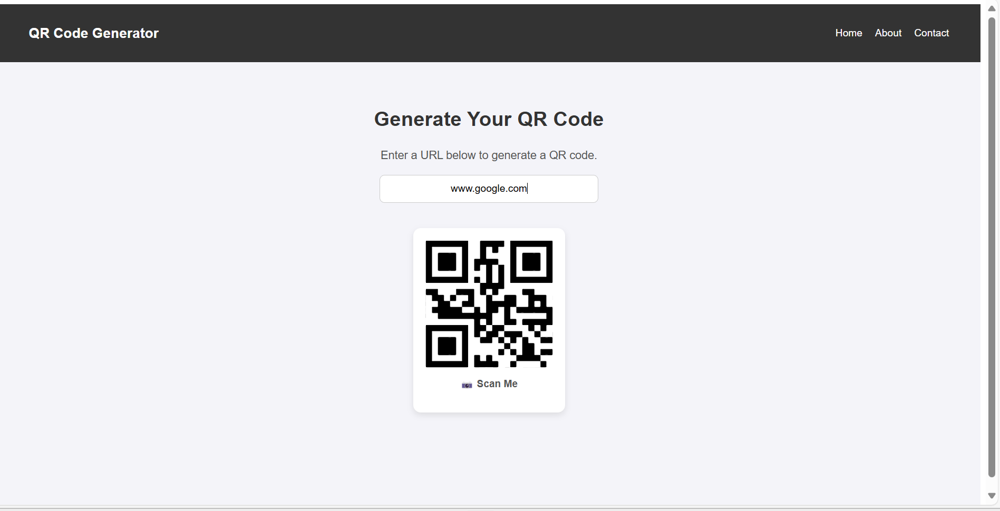

Certainly! Here's the full `README.md` that you can directly copy and paste into your project.

```md
# 🚀 QR Code Generator  

A simple and stylish **QR Code Generator** built with **React, Vite, and react-qr-code**.  

---

## 🌟 Features  
✔ Generate QR codes instantly by entering a URL  
✔ Clean and modern design  
✔ "Scan Me" text for easy usability  
✔ Responsive and mobile-friendly  
✔ Fast performance with Vite  

---

## 📥 Setup Project  

### 1️⃣ **Clone the Repository**  
If you haven't cloned the project yet, run:
```sh
git clone https://github.com/your-username/qr-code-generator.git
cd qr-code-generator
```

If you haven’t initialized Git yet, do:
```sh
git init
git remote add origin https://github.com/your-username/qr-code-generator.git
```

---

### 2️⃣ **Install Dependencies**  
Run the following command to install all required dependencies:  
```sh
npm install
```

---

### 3️⃣ **Run the Development Server**  
To start the project in development mode, run:  
```sh
npm run dev
```
The project will be available at **http://localhost:5173/**  

---

### 4️⃣ **Build for Production**  
To create an optimized production build, use:  
```sh
npm run build
```
This will generate a `dist` folder with optimized static files.

---

### 5️⃣ **Preview the Production Build**  
To test the production build locally, run:  
```sh
npm run preview
```
Then, open **http://localhost:4173/** in your browser.

---

## 📷 Preview  
  

---

## 🛠️ Technologies Used  
- **React** – Frontend library  
- **Vite** – Fast development environment  
- **react-qr-code** – QR code generator package  

---

## 📜 License  
This project is open-source and free to use.  

---

### ✨ **Contributions & Feedback**  
Feel free to fork, contribute, or provide feedback! 😊  
```

---

You can now copy this directly into your `README.md` file. Let me know if you'd like more additions! 😊
